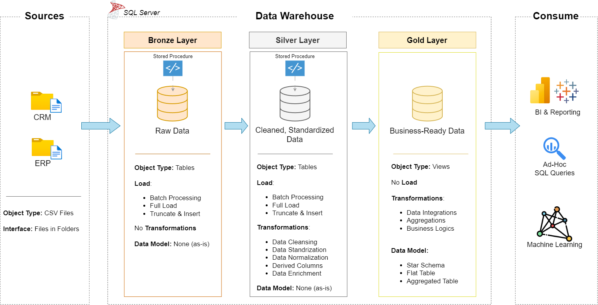
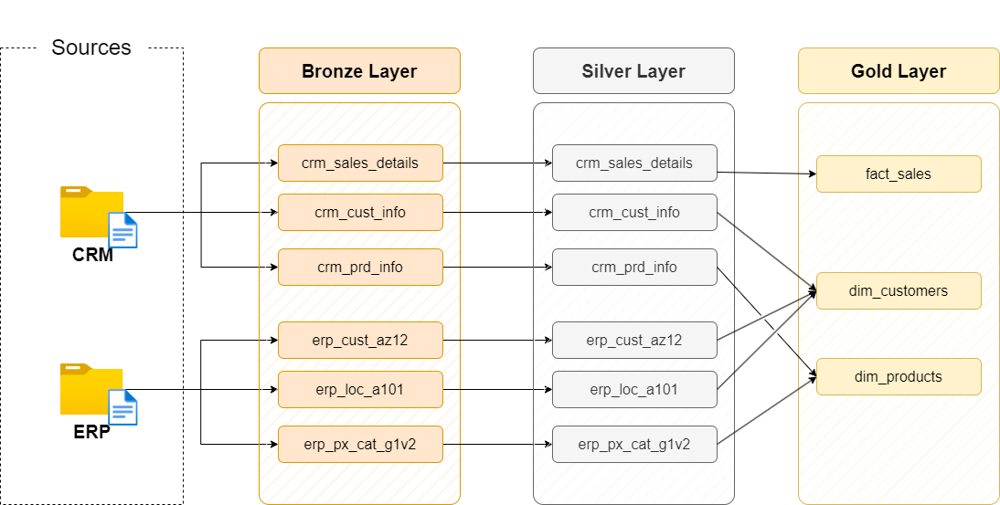
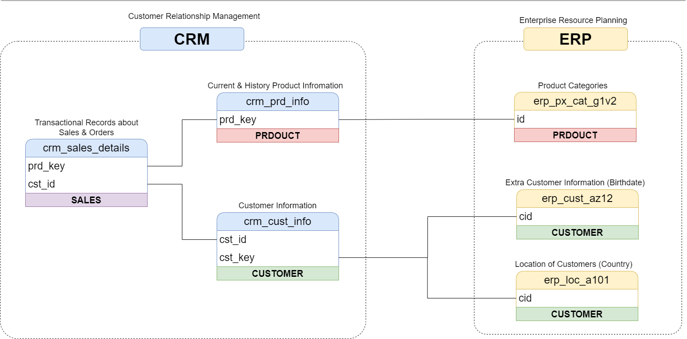
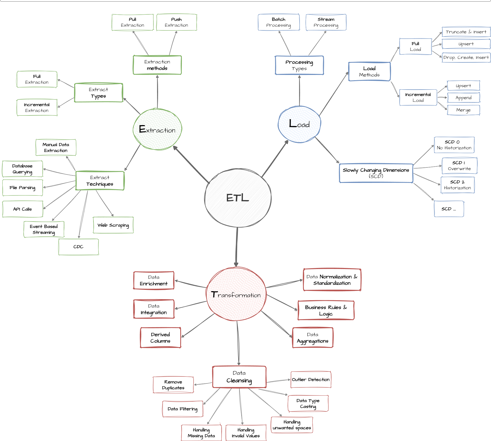
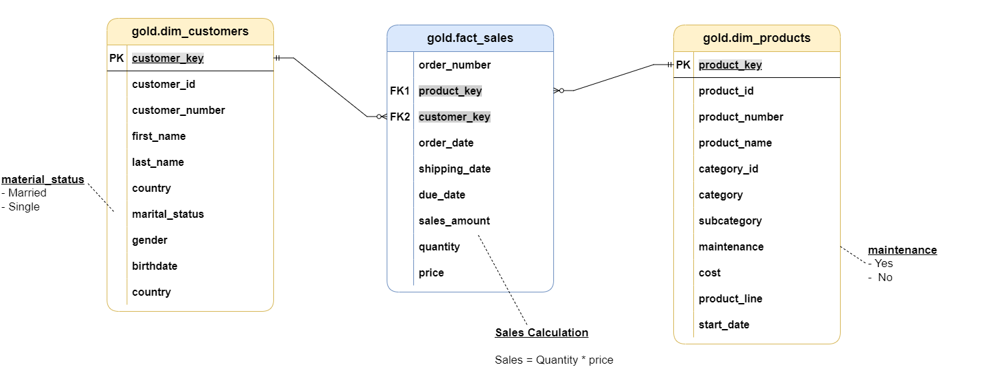

# SQL Data Warehouse Project

A modern SQL Server data warehouse built end-to-end with T-SQL: raw CRM and ERP CSV extracts are ingested, cleansed, and modeled into a star schema ready for analytics and reporting.

The project follows the **Medallion Architecture** (Bronze → Silver → Gold), with each layer implemented as versioned DDL and stored-procedure scripts, plus SQL-based data quality tests.



## Architecture

| Layer      | Purpose                                     | Objects                             |
|------------|----------------------------------------------|--------------------------------------|
| **Bronze** | Raw data, loaded as-is from source CSVs     | Tables, loaded via `BULK INSERT`    |
| **Silver** | Cleansed, standardized, and conformed data  | Tables, loaded via stored procedure |
| **Gold**   | Business-ready, dimensional model           | Views (star schema)                 |

**Sources:** two operational systems delivered as flat files —

- **CRM**: customer info, product info, sales details
- **ERP**: customer demographics, location, product category

### ETL flow



### Source-to-target integration



### ETL techniques used



## Data Model

The Gold layer exposes a star schema of one fact table and two dimensions:



- `gold.dim_customers` — customer attributes enriched with demographic (ERP) and CRM data, gender resolved with CRM as the primary source and ERP as fallback
- `gold.dim_products` — current product attributes joined to category/subcategory, filtered to active (non-historical) products
- `gold.fact_sales` — sales transactions linked to both dimensions via surrogate keys

Full column-level documentation is in [docs/data_catalog.md](docs/data_catalog.md).

## Repository Structure

```text
sql-data-warehouse-project/
│
├── datasets/                    # Raw source CSVs (CRM and ERP extracts)
│   ├── source_crm/
│   └── source_erp/
│
├── docs/                        # Architecture diagrams and data catalog
│   ├── data_architecture.png
│   ├── data_flow.png
│   ├── data_integration.png
│   ├── data_model.png
│   ├── ETL.png
│   └── data_catalog.md
│
├── scripts/
│   ├── init_database.sql        # Creates the DataWarehouse database and schemas
│   ├── 1. bronze/                # Raw table DDL + BULK INSERT load procedure
│   ├── 2. silver/                # Cleansed table DDL + transform/load procedure
│   └── 3. gold/                  # Business-ready views (star schema)
│
├── tests/                       # SQL data quality checks for Silver and Gold
│   ├── quality_checks_silver.sql
│   └── quality_checks_gold.sql
│
└── README.md
```

## How It Works

1. **`scripts/init_database.sql`** — creates the `DataWarehouse` database and the `bronze`, `silver`, and `gold` schemas.
2. **Bronze** — `ddl_bronze.sql` defines raw tables mirroring source file structure; `proc_load_bronze.sql` truncates and reloads them from the CSVs in `datasets/` via `BULK INSERT`.
3. **Silver** — `ddl_silver.sql` defines cleansed tables; `proc_load_silver.sql` applies deduplication, trimming, standardization of codes (e.g. gender, marital status), and date/type fixes before loading.
4. **Gold** — `ddl_gold.sql` creates views (`dim_customers`, `dim_products`, `fact_sales`) that join and reshape Silver data into the final star schema for reporting.
5. **Tests** — `tests/quality_checks_silver.sql` and `tests/quality_checks_gold.sql` validate primary key uniqueness, unwanted whitespace, standardization, and referential integrity between fact and dimension tables. Each check is expected to return no rows.

## Getting Started

**Requirements:** SQL Server (e.g. SQL Server Express) and a client such as SSMS or Azure Data Studio.

1. Clone the repo and update the CSV file paths in `scripts/1. bronze/proc_load_bronze.sql` to match your local path to `datasets/`.
2. Run `scripts/init_database.sql` to create the database and schemas.
3. Run, in order:
   - `scripts/1. bronze/ddl_bronze.sql` then `proc_load_bronze.sql`
   - `scripts/2. silver/ddl_silver.sql` then `proc_load_silver.sql`
   - `scripts/3. gold/ddl_gold.sql`
4. Run the scripts in `tests/` to validate data quality before querying the Gold views.

## License

MIT